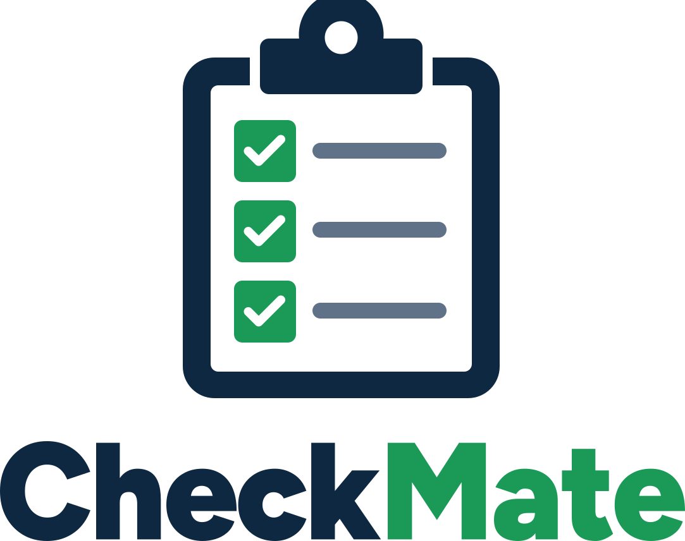

<h1 align="center"></h1>

[](https://github.com/dylan-smith/CheckMate/actions/workflows/ci.yml)

A checklist management app with:
- **Backend:** ASP.NET Core Web API (.NET 10) + Entity Framework Core + SQL Server
- **Frontend:** React 19 + TypeScript (Vite + Material UI)

## Features

- Create, edit, and delete checklists
- Enforces unique checklist names
- RESTful API with OpenAPI support

## Prerequisites

- [.NET 10 SDK](https://dotnet.microsoft.com/download)
- [Node.js](https://nodejs.org/) (LTS recommended)
- [npm](https://www.npmjs.com/)
- SQL Server (optional — an in-memory database is used by default in development)

## Local Development Setup

### Backend

```bash
cd backend/CheckMate.Api
dotnet run
```

The API starts at `http://localhost:5269` by default. In development mode an in-memory database is used automatically (configured in `appsettings.Development.json`). The OpenAPI document is served at `/openapi/v1.json`, and you can explore the API interactively with Scalar at `/scalar` (e.g. `http://localhost:5269/scalar`). Both are available in every environment, including production.

To use SQL Server for local development instead, set `UseInMemoryDatabase` to `false` and update the connection string in `backend/CheckMate.Api/appsettings.Development.json`.

### Frontend

```bash
cd frontend
npm ci
npm run dev
```

The frontend dev server starts at `http://localhost:5173`. Set the `VITE_API_BASE_URL` environment variable if your backend runs on a different URL.

### Dev Container

The repo includes a dev container (`.devcontainer/`) with everything preinstalled: .NET 10, Node 24, Playwright Chromium, the Azure CLI with Bicep, the GitHub CLI and Claude Code. It also runs a SQL Server 2022 container next to the app. Open the repo in VS Code and choose **Dev Containers: Reopen in Container**, or open it in GitHub Codespaces. Docker is required locally.

When the container is created it restores packages, installs the frontend dependencies and Playwright, and runs the DbUp migrations against the SQL container. Inside the container:

- `dotnet run` for the API uses the SQL container by default (`UseInMemoryDatabase=false` and `ConnectionStrings__CheckMate` are set as container environment variables). Set `UseInMemoryDatabase=true` to use the in-memory database instead.
- The database lives in a named Docker volume, so data persists across container rebuilds. To apply new migrations, re-run `dotnet run --project backend/CheckMate.Database -- "$ConnectionStrings__CheckMate"`.
- The E2E tests always run the API in-memory, because they delete existing checklists. Playwright never reuses an API that is already running, so stop your dev API before running `npm run test:e2e`, or Playwright fails because port 5269 is taken.
- Sign in to `az`, `gh` and `claude` yourself inside the container. Claude Code's config is stored in a named volume, so you only need to sign in once.

## Common Tasks

### Running Backend Tests

```bash
cd backend/CheckMate.Api.Tests
dotnet test
```

### Linting the Frontend

```bash
cd frontend
npm run lint
```

### Building the Frontend for Production

```bash
cd frontend
npm run build
```

The output is written to `frontend/dist`.

### Previewing the Production Build

```bash
cd frontend
npm run preview
```

## Deployment

1. **Backend** — Publish the API with `dotnet publish -c Release` from `backend/CheckMate.Api`. Deploy the output to any host that supports .NET 10 (Azure App Service, Docker, etc.). Configure the `ConnectionStrings:CheckMate` setting to point to your production SQL Server instance and set `UseInMemoryDatabase` to `false`. If the frontend will be served from a different origin than the API, also configure `Cors:AllowedOrigins` to include the production frontend URL(s) so the browser can call the API.

   **Application Insights** — The API automatically sends telemetry to Azure Application Insights when a connection string is available. Set the `APPLICATIONINSIGHTS_CONNECTION_STRING` environment variable (or the `AzureMonitor:ConnectionString` app setting) to your Application Insights connection string. When using Azure App Service, you can connect Application Insights directly from the Azure Portal, which sets `APPLICATIONINSIGHTS_CONNECTION_STRING` automatically. Telemetry is silently disabled when neither value is configured (e.g. during local development).

2. **Frontend** — Run `npm run build` in `frontend` and serve the contents of `frontend/dist` with any static file host (Azure Storage Account static website, Nginx, etc.). Set `VITE_API_BASE_URL` to the production API URL before building. When using a different origin for the frontend, make sure the backend `Cors:AllowedOrigins` setting includes that frontend URL.

   **Application Insights** — The frontend sends page views, exceptions, API calls and checklist events to Application Insights using the Application Insights JavaScript SDK when `VITE_APPINSIGHTS_CONNECTION_STRING` is set at build time (CI reads it from the API's `APPLICATIONINSIGHTS_CONNECTION_STRING` app setting, so both report to the same resource). API calls carry a W3C `traceparent` header, so each browser request and the API request it triggers share one operation in Application Insights. The SDK sets `ai_user` and `ai_session` cookies to count users and sessions. Telemetry is disabled when the variable isn't set (local development, unit tests and E2E runs).

## Project Structure

```
CheckMate/
├── backend/
│   ├── CheckMate.Api/          # ASP.NET Core Web API
│   ├── CheckMate.Database/     # Database CLI project for migrations
│   └── CheckMate.Api.Tests/    # xUnit backend tests
├── frontend/                    # React + TypeScript (Vite)
├── infra/                       # Bicep Infrastructure as Code
│   ├── main.bicep               # Root Bicep template
│   ├── main.bicepparam          # Example parameter values
│   └── modules/                 # Reusable Bicep modules
├── CONTRIBUTING.md
├── SECURITY.md
├── LICENSE
└── README.md
```

## Run Playwright E2E tests

Playwright automatically starts the backend and frontend servers when tests run.
Before running tests for the first time, install dependencies and the test browser:

```bash
cd frontend
npm ci
npx playwright install chromium --with-deps
```

Then run the tests (this builds the frontend and launches both servers automatically):

```bash
npm run test:e2e
```

To run tests with the interactive UI:
```bash
npm run test:e2e:ui
```

## Azure Deployment

The CI workflow (`.github/workflows/ci.yml`) includes deployment jobs that run after all checks pass. Deployment only runs on pushes to `main` (not on pull requests).

### Infrastructure as Code

All Azure resources are defined using [Bicep](https://learn.microsoft.com/en-us/azure/azure-resource-manager/bicep/overview) templates located in the `infra/` directory:

```
infra/
├── main.bicep           # Root template — wires all modules together
├── main.bicepparam      # Production parameter values (resource names, regions, SKUs)
├── modules/
│   ├── alerts.bicep     # Alert rules, action group, availability test, Slack notifier and budget
│   ├── appservice.bicep # App Service Plan + App Service (Linux/.NET 10) and its app settings
│   ├── monitoring.bicep # Log Analytics Workspace + Application Insights
│   ├── sql.bicep        # Azure SQL Server (Entra-only auth) + serverless Database and its diagnostic logs
│   ├── storage.bicep    # Storage Account for the frontend static website
│   └── workbook.bicep   # "CheckMate Health" Azure Monitor Workbook
└── workbooks/
    └── health.workbook.json # Workbook content, with placeholder tokens for resource IDs
```

The `deploy-infrastructure` CI job runs `infra/main.bicep` on every push to `main`, ensuring the Azure environment is always in sync with the declared configuration. All other deployment jobs depend on this job.

The template owns **all** App Service app settings (connection string, CORS origin, Application Insights), so add new settings in `infra/modules/appservice.bicep` rather than in the portal — anything set by hand is removed on the next deployment. The static website (`$web` container, `index.html` documents) is a data-plane setting that ARM can't manage, so CI enables it with `az storage blob service-properties update`.

The **CheckMate Health** workbook (Application Insights → Workbooks, or in the resource group) shows API, frontend and infrastructure health on one page. It combines Application Insights telemetry, App Service and SQL logs from the workspace, and platform metrics for the App Service, SQL database and Storage account. Its **Overview** tab starts with any active alerts and shows the `/health` availability test results. Its **Overall** tile is the worst of the colored tiles, so it answers "is the app healthy?" at a glance. Exceptions only count against health when they need attention: API exceptions logged below Error (such as retried SQL connections while the database resumes), automated test traffic (smoke tests and Generate Load, which run in headless Chrome) and browser network errors the user recovered from are counted as expected, and the exception tables give the reason for each. Its **Alerts** tab shows how often each alert rule fired, when, and how long it took to resolve, for up to the last 30 days (how long Azure keeps fired alerts). Viewers with Reader on only the resource group don't see the subscription-wide Service Health alert there, and budget notifications are listed separately because they come from Cost Management. Its **Costs** tab shows this month's spend and forecast against the monthly budget, with a daily actual-and-forecast chart, then what the resource group costs in total, by service, by day and by resource, from Azure Cost Management (viewers need at least Reader on the resource group). Its **Investigate** tab links to the portal tools, logs and deployment history to check when digging into an incident, and says where to look when each alert fires. Its Application Insights time charts mark each backend deployment with the release annotation `azure/webapps-deploy` adds (green for success, red for a failed deployment). The workbook is also owned by the template, so edits made only in the portal are overwritten on the next deployment. To change it, edit it in the portal, copy the JSON from **Edit → Advanced Editor**, swap the resource IDs and site URLs back to the `__*__` tokens listed in `infra/modules/workbook.bicep`, and commit it to `infra/workbooks/health.workbook.json`.

To put some data on the workbook, run the **Generate Load** workflow (`.github/workflows/load-test.yml`) from the Actions tab and choose how many minutes it should run. It drives real browsers through the frontend and calls the API directly, including a few requests that fail on purpose, and deletes every checklist it created. It uses the `production` environment, so it can only run from `main`.

#### Alerts

`infra/modules/alerts.bicep` defines the alerts. They all notify the **CheckMate-Alerts** action group, which sends an email and an Azure mobile app push to `alertEmail` (set in `infra/main.bicepparam`). When the `SLACK_WEBHOOK_URL` secret is set, it also posts to Slack through the **CheckMate-SlackAlerts** Logic App. Metric and log alerts also send a message when they resolve. Each Slack message says what was measured against the threshold (or Azure's own explanation for resource and service health), links to the resource, the alert and the health workbook, and, when it fires, lists numbered **What to do** steps for investigating and fixing it. The steps live next to each rule in `alerts.bicep` (`steps`, or `alertSteps` for rules that aren't metric alerts), so update them when a rule or the workbook changes.

| Alert | Fires when | Sev |
|-------|------------|-----|
| API down | The availability test on `{api}/health` (one location, every 15 minutes) fails 3 of its last 4 runs, after 30 to 45 minutes of downtime | 1 |
| Resource health | Azure reports the App Service, database or storage account unavailable or degraded | 1 |
| Service health | Azure reports an incident or planned maintenance for App Service, SQL Database, Storage or Monitor in West US/West US 2 | 2 |
| API server errors | More than 5 HTTP 5xx responses in 15 minutes | 2 |
| API dependency failures | More than 10 failed backend dependency calls (mostly SQL) in 15 minutes | 2 |
| Browser errors | More than 5 frontend exceptions in an hour | 2 |
| Browser API call failures | More than 5 failed API calls from the frontend in an hour | 2 |
| CPU quota | More than 45 of the F1 plan's 60 daily CPU minutes used in 24 hours (the app stops when they run out) | 2 |
| SQL free offer running out | Less than 20% of the month's free vCore-seconds left (the database pauses until next month when they run out) | 2 |
| Frontend storage availability | Blob storage less than 99% available over an hour | 2 |
| Slow API | Average response time over 5 seconds for 30 minutes (at least 10 requests, not counting deployment calls) | 3 |
| Slow page loads | 75th percentile page load over 4 seconds in 6 hours (at least 5 loads) | 3 |
| SQL storage | Database over 80% of its maximum size | 3 |
| Failure anomalies | Application Insights smart detection sees an unusual rise in failures | 3 |
| Monthly budget | Resource group costs pass 80% of `monthlyBudget`, or are forecast to pass 100% | — |

`/health` doesn't check the database, so the availability test doesn't stop the serverless database from auto-pausing. A backend deployment turns the availability test off while it has the API paused and back on when it finishes, so a deployment doesn't fire **API down**. If a deployment leaves the API paused, the test is still turned back on so the alert fires.

To set up Slack, create a Slack app with an **Incoming Webhook** for the alerts channel and save the webhook URL as the `SLACK_WEBHOOK_URL` repository secret. The next deployment creates the Logic App. To get push notifications, sign in to the Azure mobile app as `alertEmail`. To check the whole chain, open the action group in the portal and choose **Test**.

When the `ALERT_INVESTIGATION_TOKEN` secret is set too, Claude investigates every fired alert and posts what it finds in the same Slack channel. See [Alert Investigation](#alert-investigation).

Azure won't move a budget's start date once it exists, so `budgetStartDate` in `infra/main.bicepparam` stays fixed at the month the budget was first deployed. A new environment should set it to the first of the month it's created in.

#### Deploying Infrastructure Manually

To preview or apply infrastructure changes outside of CI, log in to Azure (`az login`, with MFA), set the runtime connection string, and run:

```powershell
$env:AZURE_SQL_CONNECTION_STRING = '<connection string>'

# Preview — should show no Create/Delete against the existing resources
az deployment group what-if --resource-group CheckMate --template-file infra/main.bicep --parameters infra/main.bicepparam

# Apply
az deployment group create --resource-group CheckMate --template-file infra/main.bicep --parameters infra/main.bicepparam
```

#### Identities & Permissions

The template doesn't manage identities, role assignments or database users, so a new environment needs these set up by hand:

| Identity | Grants |
|----------|--------|
| `checkmate-deploy` (user-assigned managed identity, `AZURE_CLIENT_ID`) | Federated credential for subject `repo:dylan-smith@1508559/CheckMate@1213636751:environment:production`; **Contributor** on the resource group; **Storage Blob Data Owner** on the frontend storage account (static website setup, `npm run deploy` and database backup uploads use `--auth-mode login`); `db_owner` database user (runs the migrations and pre-migration backups) |
| `checkmate-pr-whatif` (user-assigned managed identity, `AZURE_WHATIF_CLIENT_ID`) | Federated credential for subject `repo:dylan-smith@1508559/CheckMate@1213636751:pull_request`; custom **CheckMate What-If Reader** role (`*/read`, `Microsoft.Resources/deployments/validate/action`, `Microsoft.Resources/deployments/whatIf/action`, `Microsoft.Resources/deployments/write`) on the resource group |
| `checkmate-alert-investigator` (user-assigned managed identity, `AZURE_ALERT_INVESTIGATOR_CLIENT_ID`) | Federated credential for subject `repo:dylan-smith@1508559/CheckMate@1213636751:environment:alert-investigation`; **Reader**, **Monitoring Reader**, **Log Analytics Reader** and **Cost Management Reader** on the resource group; **Monitoring Reader** on the subscription (Service Health events). Read-only, used by the alert investigation workflow |
| App Service system-assigned identity | `db_datareader` + `db_datawriter` database user (the API's runtime connection) |

GitHub issues OIDC tokens for this repo with immutable-ID subjects, so federated credentials must use the portal's **Other issuer** scenario (issuer `https://token.actions.githubusercontent.com`) rather than the GitHub Actions template. Create the database users as the SQL Entra admin, e.g. `CREATE USER [checkmate-deploy] FROM EXTERNAL PROVIDER; ALTER ROLE db_owner ADD MEMBER [checkmate-deploy];`.

### Deployment Architecture

| Component | Azure Service | Endpoint |
|-----------|--------------|----------|
| Backend API | Azure App Service (Linux/.NET 10) | `https://checkmate-heesaxh5agdygvew.westus2-01.azurewebsites.net` |
| Frontend | Azure Storage Account (static website) | `https://checkmateweb.z22.web.core.windows.net` |
| Database | Azure SQL serverless database (Entra-only auth) | — |
| Monitoring | Log Analytics + Application Insights (App Service HTTP/console/app/platform logs and SQL errors, timeouts, blocks, deadlocks and automatic tuning go to the `CheckMate` workspace), plus the **CheckMate Health** workbook | — |

### Database Backups

Before running migrations, the `deploy-backend` job exports the database to a BACPAC and uploads it to the private `db-backups` container in the `checkmateweb` storage account. It does this on every deploy, including the daily scheduled run. Files are named `CheckMate-<UTC timestamp>-<commit>.bacpac`. A lifecycle management rule deletes backups older than `backupRetentionDays` (30 days, set in `infra/main.bicepparam`). If the backup fails, the migrations don't run.

To restore, import a backup into a **new** database, check it, then point the app at it or swap the names:

```powershell
az storage blob list --auth-mode login --account-name checkmateweb --container-name db-backups --output table
az storage blob download --auth-mode login --account-name checkmateweb --container-name db-backups --name <file>.bacpac --file backup.bacpac
sqlpackage /Action:Import /SourceFile:backup.bacpac /TargetServerName:checkmate-sql.database.windows.net /TargetDatabaseName:CheckMate-Restored /UniversalAuthentication:True
```

The Azure SQL built-in point-in-time restore (7 days) is still available for restoring to a moment between backups.

### Required GitHub Variables

| Variable | Description |
|----------|-------------|
| `AZURE_CLIENT_ID` | Client ID of the `checkmate-deploy` managed identity (for OIDC login) |
| `AZURE_TENANT_ID` | Azure Active Directory tenant ID |
| `AZURE_SUBSCRIPTION_ID` | Azure subscription ID |
| `AZURE_RESOURCE_GROUP` | Azure resource group containing all resources |
| `AZURE_BACKEND_APP_NAME` | Name of the Azure App Service for the backend |
| `AZURE_BACKEND_URL` | Public URL of the backend API (e.g. `https://checkmate-api.azurewebsites.net`) |
| `AZURE_STORAGE_ACCOUNT_NAME` | Name of the Azure Storage Account used to host the frontend static website |

All other resource names, regions and SKUs live in `infra/main.bicepparam`.

The `infrastructure-what-if` PR job doesn't use the `production` environment, so it only sees **repository-level** variables. Define these at repository level (the environment can keep its own copies):

| Variable | Description |
|----------|-------------|
| `AZURE_WHATIF_CLIENT_ID` | Client ID of the read-only managed identity used for PR what-if previews |
| `AZURE_TENANT_ID` | Azure Active Directory tenant ID |
| `AZURE_SUBSCRIPTION_ID` | Azure subscription ID |
| `AZURE_RESOURCE_GROUP` | Azure resource group containing all resources |

The what-if identity is a user-assigned managed identity with a federated credential for this repository's `pull_request` tokens and a custom role on the resource group limited to `*/read`, `Microsoft.Resources/deployments/validate/action`, `Microsoft.Resources/deployments/whatIf/action` and `Microsoft.Resources/deployments/write` (needed for nested module deployments; it can't write any resource).

### Required GitHub Secrets

| Secret | Description |
|--------|-------------|
| `AZURE_SQL_CONNECTION_STRING` | SQL Server connection string used at runtime and for migrations (applied to the App Service by the Bicep deployment) |
| `SLACK_WEBHOOK_URL` | Optional. Slack incoming webhook URL that alerts post to. Without it, alerts only go to email and the Azure mobile app |
| `CLAUDE_CODE_OAUTH_TOKEN` | Claude Code OAuth token (from `claude setup-token`) used by the CI failure and alert investigation workflows |
| `ALERT_INVESTIGATION_TOKEN` | Optional. Fine-grained personal access token for this repository only, with **Actions: Read and write**. The infrastructure deployment gives it to the Slack Logic App, which uses it to start the alert investigation workflow. Without it (or `SLACK_WEBHOOK_URL`), alerts aren't investigated |
| `AUTOMERGE_TOKEN` | Personal access token with write access to contents and pull requests. The Dependabot workflows use it to comment, and the CI failure investigation workflow uses it to push fix branches and open PRs (so CI runs on them) |

### CI Failure Investigation

When CI fails on a pull request, `.github/workflows/ci-failure-investigation.yml` runs Claude Code to investigate. If a code change fixes the failure, Claude opens a separate PR from a `claude/ci-fix/` branch, based on the failing PR's branch, and never pushes to the failing branch itself. Either way, it comments on the failing PR with the root cause and what it did. It skips fork PRs, Dependabot PRs and its own `claude/ci-fix/` PRs. CI runs on pull requests into any branch, so the stacked fix PRs are checked too.

### Alert Investigation

When an alert fires (not when it resolves) or a budget alert is sent, the **CheckMate-SlackAlerts** Logic App posts the alert to Slack, adds a note that Claude is investigating, and starts `.github/workflows/alert-investigation.yml` with the alert payload. Claude Code reads the alert rule in `infra/modules/alerts.bicep`, queries Application Insights, Log Analytics, metrics, the activity log, resource health and costs, and checks recent deployments and Generate Load runs. It then posts a follow-up in the same channel with its verdict: for a real problem, the steps to fix it; for a false positive, the change to the rule (threshold, window, filter or query) that would stop it firing falsely. If Claude can't finish, or the Logic App can't start the workflow (for example because the token expired), Slack gets a message saying so.

Claude only has read access: the `checkmate-alert-investigator` identity can't change Azure resources, and its GitHub token can only read the repository. It never sees the Slack webhook either: it uploads its findings as an artifact, and a separate job on a fresh runner posts them. The Logic App hides its HTTP actions' inputs (the webhook URL and GitHub token) from its run history.

To set it up:

1. Create the `checkmate-alert-investigator` identity and its roles (see [Identities & Permissions](#identities--permissions)).
2. Create a GitHub environment named `alert-investigation`, restrict its deployment branches to `main`, and add the `AZURE_ALERT_INVESTIGATOR_CLIENT_ID` variable to it. The workflow also uses the repository-level `AZURE_TENANT_ID`, `AZURE_SUBSCRIPTION_ID` and `AZURE_RESOURCE_GROUP` variables.
3. Save a fine-grained personal access token as the `ALERT_INVESTIGATION_TOKEN` secret (see [Required GitHub Secrets](#required-github-secrets)), and renew it before it expires. The next deployment adds it to the Logic App.

To try it, choose **Test** on the **CheckMate-Alerts** action group, or run **Alert Investigation** from the Actions tab and paste an alert payload, such as the trigger body of a Logic App run.

### Environment

The workflow uses the `production` GitHub Environment for all deployments. Configure the `production` environment in your repository settings to enable approval gates and environment-specific secrets, and restrict its deployment branches to `main` so pull requests can't use its credentials or secrets.

## Contributing

Contributions are welcome! Please read [CONTRIBUTING.md](CONTRIBUTING.md) for guidelines on how to get started.

Use the provided templates when opening issues or pull requests:

- [Bug Report](https://github.com/dylan-smith/CheckMate/issues/new?template=bug_report.md)
- [Feature Request](https://github.com/dylan-smith/CheckMate/issues/new?template=feature_request.md)
- [Enhancement](https://github.com/dylan-smith/CheckMate/issues/new?template=enhancement.md)

Pull requests should follow the [PR template](./.github/PULL_REQUEST_TEMPLATE.md) checklist before requesting review.

## Security

To report a security vulnerability, see [SECURITY.md](SECURITY.md).

## License

This project is licensed under the MIT License. See [LICENSE](LICENSE) for details.
